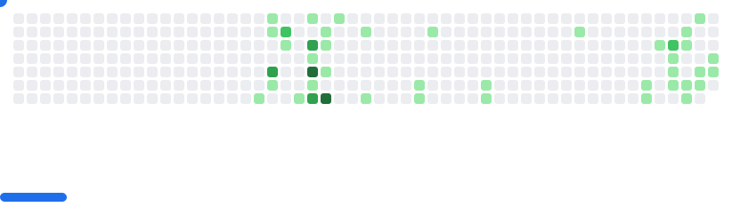

<h2>Alexander Martínez González </h2>
</em>

 

  

    

<h4 align="center">💻 Programming languages (and html)</h4>

</a>
</a>
</a>
</a>
</a>
</a>
</a>
</a>
</a>
</a>
</a>
</a>
</a>

<h4 align="center">📚 Frameworks and Libraries</h4>

  
  
  
  
  
  

<h4 align="center">⚙ Software</h4>

<h4 align="center">☁ Cloud and Providers</h4>

 
<picture>
  <source
    media="(prefers-color-scheme: dark)"
    srcset="images/breakout-dark.svg"
  />
  <source
    media="(prefers-color-scheme: light)"
    srcset="images/breakout-light.svg"
  />
  
</picture>
